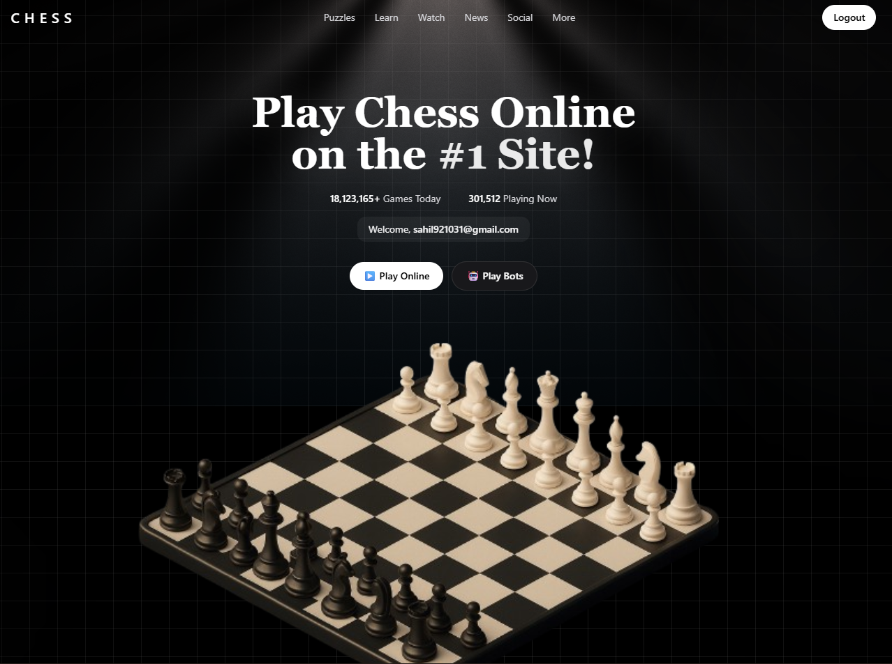
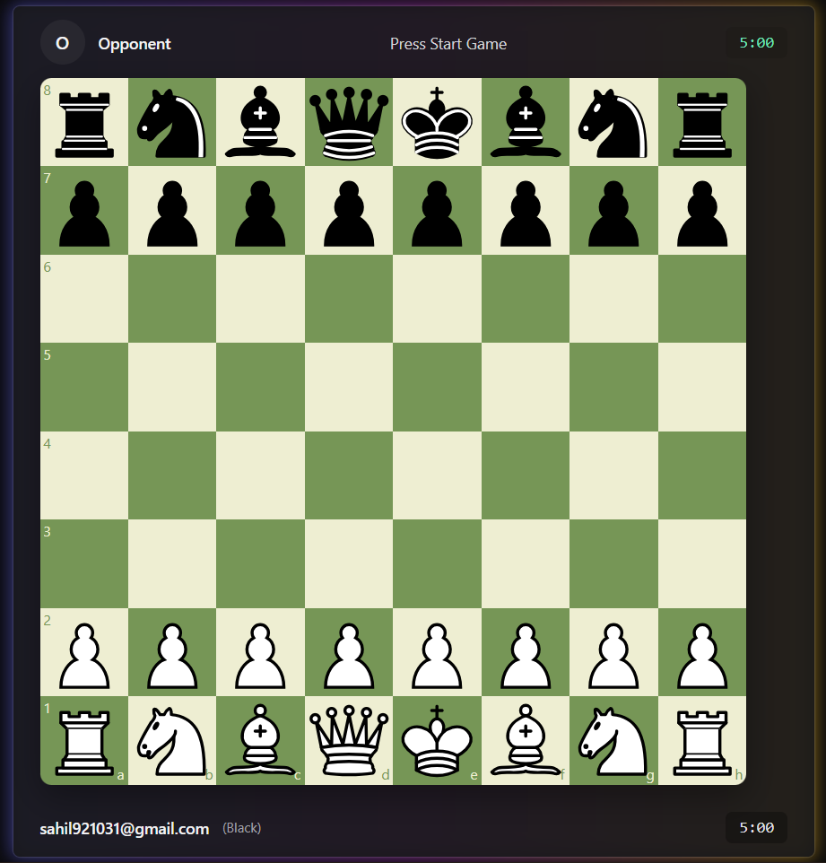

# ♟ WeChess – Real-Time Multiplayer Chess

A real-time **full-stack<** chess game built using the **MERN stack** with **live gameplay updates via WebSockets**.  
Players can compete online, spectate matches, and even **share challenge links to play instantly — no signup needed.**

🔗 **Live App:** https://wechess.netlify.app

---

<div style="display: flex; gap: 10px;">
  
  
</div>

## ✨ Features

- 🧑‍🤝‍🧑 **Multiplayer Chess with Live Moves**
- 🔗 **Challenge Link System** — share & play instantly
- ⚡ **Real-time updates using WebSockets / Socket.io**
- 🚪 **Play as a registered user or guest**
- ✔️ **Move validation, turn system, check/checkmate detection**
- 🔄 **Reconnect & resume gameplay**
- 🏁 Automatic match-result detection

---

## 🛠 Tech Stack

| Layer | Technologies |
|------|-------------|
| Frontend | React, Tailwind CSS, Chess.js, Chessboard UI, Framer Motion, Redux, Socket IO |
| Backend | Node.js, Express.js |
| Real-time Communication | Socket.io |
| Database | MongoDB + Mongoose |
| Deployment | Netlify (Frontend), Backend Render.com |

---

## 📁 Project Structure
```bash

WeChess/
├── client/ # React Frontend
│ ├── src/components/
│ ├── src/pages/
│ └── src/store/
│
├── server/ # Node.js + Express Backend
│ ├── auth/
│ ├── game/
│ ├── config 
│ └── index.js
│
└── README.md

---

## 🚀 Run Project Locally

# Clone repo
git clone https://github.com/Sahillrathore/multiplayer-chess.git
cd multiplayer-chess

# Install dependencies
cd client && npm install
cd ../server && npm install

# Start backend
cd server
npm run dev

# Start frontend
cd ../client
npm run dev

## 🚀 Run Project Locally

* User logs in or continues as guest
* A new match is created OR joined via shared link
* Moves sync live between both players
* Checkmate / Resign → Game ends automatically